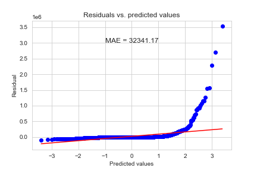

## Introduction 

This is a repository that contains my code submission for the **`UmojaHack Africa 2022: Monthly Insurance Claim Prediction Challenge (INTERMEDIATE)`**.

Short-term insurance claims are one of the largest costs in the insurance industry, and are extremely difficult to forecast. Zimnat Insurance wants to predict the value of future claims per client, in order to better forecast annual costs.

The objective of this challenge is to create a machine learning model to predict how much a client will claim from Zimnat per month for a whole year.

The solution will aid [Zimnat](https://www.zimnat.co.zw/) in being better prepared to address claims that are submitted, and improve customer satisfaction by alerting clients to possible claims they will make in the future.

## Packages and libraries used:

|S/N|Package|Use case|
|---|-------|--------|
|1.|`Scikit-learn`|Machine Learning package|
|2.|`Numpy`|Numeric compuation|
|3.|`Pandas`|Dataframe manipulation|
|4.|`Matplotlib` and `Seaborn`|Visualisation|
|5.|`Scipy`|Scientific computation|

Code was written and compiled in `Jupyter Notebook`

## Datasets
Description to the dataset can be found [here](https://zindi.africa/competitions/umojahack-africa-2022-intermediate-challenge/data)

## Approach

I employed the use of a simple `ensemble` method of `ExtraTreesRegressor` of 65 trees to fit the data with the following hyperparameters:
* `max_depth=3`
* `criterion='mae'`
* `n_estimators=65`
* `n_jobs=-1`
* `min_samples_leaf=3`
* `min_samples_split=5` 

The data features with variance value lower than `0.9` were removed. That is,
var_{x} = (1-x)\times{x} 
x = threshold = 0.9 
The numeric values were scaled using the `z-score` normaization and the categorical features were `one-hot`encoded. Feature engineering technique was also employed.

## Model Result

A training mean-squared-error of `32341` was attained. While the test MAE is `32543`. This high error is due to the untreated outlier values that the model was fitted on. 

## Suggestion
This code is in no way the best approach. However, these are my suggestions:
1. Add more data. The more the data, the more patterns are detected
2. Treat oulier values in the `target` column
3. Feature engineering
4. Boosting of ensemble methods because number of observations is > than 1000
